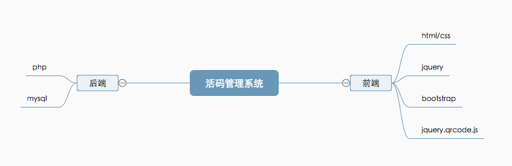

# 二维码活码管理系统

### 什么是活码?

二维码生成后,二维码图案不变，内容可随时变更，极大提高营销效率，配合美术设计二维码能力大大提升.
并且可以做到实时统计二维码扫描数据，传播效果一目了然；根据地域、网络、设备等多维度分析数据，提升管理效率.

### 二维码的活码的技术实现本质是什么?

二维码活码团主要存储一个固定的 php 路径及码的 id,扫描二维码后,服务根据请求内容从数据库中查找二维码的信息,作跳转并记录访问信息.

### 系统技术



### 重点技术
1.使用插件绘制二维码
```
// https://github.com/jeromeetienne/jquery-qrcode
// js

function paint(url, ele) {　　　　　　
    outputQRCod(url, 200, 200);　　　　　　　　　　 //转换中文字符串
    function toUtf8(str) {
        var out, i, len, c;
        out = "";
        len = str.length;
        for (i = 0; i < len; i++) {
            c = str.charCodeAt(i);
            if ((c >= 0x0001) && (c <= 0x007F)) {
                out += str.charAt(i);
            } else if (c > 0x07FF) {
                out += String.fromCharCode(0xE0 | ((c >> 12) & 0x0F));
                out += String.fromCharCode(0x80 | ((c >> 6) & 0x3F));
                out += String.fromCharCode(0x80 | ((c >> 0) & 0x3F));
            } else {
                out += String.fromCharCode(0xC0 | ((c >> 6) & 0x1F));
                out += String.fromCharCode(0x80 | ((c >> 0) & 0x3F));
            }
        }
        return out;
    }

    //生成二维码
    function outputQRCod(txt, width, height) {
        //先清空
        $(ele).empty();
        //中文格式转换
        var str = toUtf8(txt);
        //生成二维码
        $(ele).qrcode({
            render: "canvas", //canvas和table两种渲染方式
            width: width,
            height: height,
            text: str
        });
    }
}

```
2.使用 php 跳转页面
```
//php

header("Access-Control-Allow-Origin: *");
$id = isset($_GET["id"]) ? $_GET["id"] : '';
// 连主库
$conn = mysqli_connect('w.rdc.sae.sina.com.cn' . ':' . '3306', 'aaa', 'bbb', 'ccc');
// Check connection
if ($conn->connect_error) {
    die("连接失败: " . $conn->connect_error);
}
$sql = "SELECT * FROM `2code_code` WHERE id = '" . $id . "'";
$result = $conn->query($sql);
if (mysqli_num_rows($result) > 0) {
    while ($row = mysqli_fetch_assoc($result)) {
        if (!strpos($row["content"], "//")) {
            $k = "//" . $row["content"];
        } else {
            $k = $row["content"];
        }
        $v=$row["num"]+1;
$sql = "UPDATE `app_jxjweb`.`2code_code` SET `num` = '".$v."' WHERE `2code_code`.`id` = '".$id."'";
$result2 = $conn->query($sql);
        Header("HTTP/1.1 303 See Other");
        Header("Location: $k");
    }
} else {
    exit('错误路径!');
}
```

### 效果演示:

[点击](http://jxjweb.sc2yun.com/2code_web/index.html)

账号: jxj2991
密码: 666666

### 完整代码:

[github](https://github.com/jxj322991/2code)
